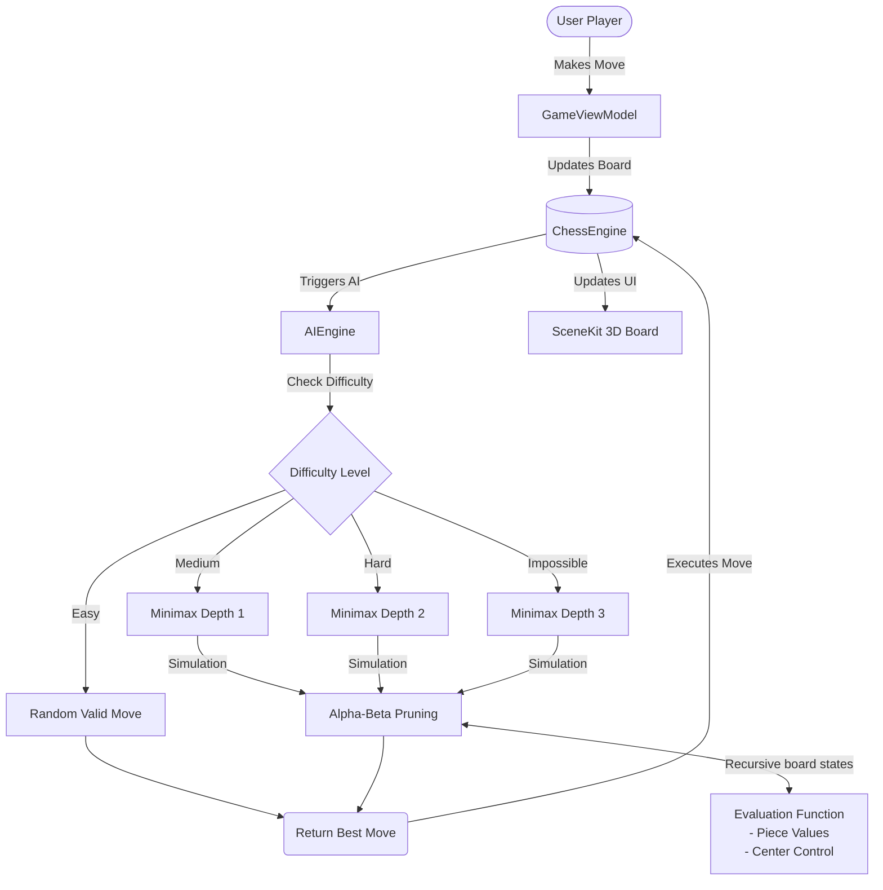

# ♟️ Chess Master

A fully-featured chess game for iOS built with **SwiftUI** and **SceneKit**, featuring a 3D rendered board, an AI opponent with multiple difficulty levels, interactive lessons, and a premium visual design.

## 🚀 How to Launch the App

1. **Prerequisites**: Ensure you have **Xcode 26** (or newer) installed on your macOS.
2. **Clone the repository**:
   ```bash
   git clone git@github.com:EdouardBelhomme/Chess.git
   cd Chess
   ```
3. **Open the Project**: Double-click on `Chess.xcodeproj` to open it in Xcode.
4. **Select Simulator**: In the top bar of Xcode, select an iOS Simulator (e.g., **iPhone 17 Pro** running **iOS 26**).
5. **Run**: Click the Play button (▶️) or press `Cmd + R` to build and launch the app in the simulator.

---

## 🤖 AI Bots Engine Architecture

The game features an AI opponent powered by the **Minimax algorithm with Alpha-Beta pruning**. The following diagram explains how the AI decides its moves based on the selected difficulty:



### Evaluation Function

The Evaluation Function (`evaluate`) is the "brain" of the AI. It calculates a score for a given board state by:

1. **Material Advantage**: Summing the value of all remaining pieces (Queen = 9, Rook = 5, Bishop/Knight = 3, Pawn = 1).
2. **Positional Advantage**: Awarding bonus points for controlling the 4 central squares of the board.

---

## 🏛️ App Architecture (MVVM + Services)

The app follows a strict **Model-View-ViewModel (MVVM)** architectural pattern combined with dedicated Services for business logic.

```mermaid
sequenceDiagram
    participant User
    participant View as SwiftUI / SceneKit Views
    participant VM as GameViewModel
    participant AI as AIEngine
    participant Engine as ChessEngine

    User->>View: Taps 3D piece
    View->>VM: handleSquareTap(position)
    VM->>Engine: getValidMoves(piece)
    Engine-->>VM: [Move]
    VM-->>View: Highlight valid squares

    User->>View: Taps destination
    View->>VM: handleSquareTap(destination)
    VM->>Engine: makeMove(Move)
    Engine-->>VM: Update Board State
    VM-->>View: Animate move & play sound

    rect rgb(30, 30, 40)
        Note over VM, Engine: AI Turn Processing
        VM->>AI: getBestMove(difficulty, board)
        AI->>Engine: Simulate moves recursively
        Engine-->>AI: Board evaluations
        AI-->>VM: Best Move
        VM->>Engine: makeMove(Best Move)
        Engine-->>View: Animate AI move
    end
```



---

## ✨ Key Features

### 🎮 3D Chess Board

The board and pieces are rendered in real-time 3D using **SceneKit**. Each of the 6 piece types (Pawn, Rook, Knight, Bishop, Queen, King) has a unique geometric model built from SceneKit primitives — no external 3D assets required.

### 📚 Learn to Play

A built-in tutorial mode with **11 interactive lessons** organized into 3 categories:

- **Movement Basics** — Pawn, Knight, Rook, Bishop, Queen, and King movement
- **Special Rules** — Castling, En Passant, and Pawn Promotion
- **Winning the Game** — Check and Checkmate

### 🎨 Themes & Customization

- **8 Board Themes** — Classic, Wood, Midnight, Modern, Minimal, Retro 70s, Light, Dark
- **App Styles** — Modern (gradient), Light, Dark, Minimal, Retro
- **Gameplay Toggles** — Show legal moves, show coordinates, UI haptics and sounds.

---

## 📂 Project Structure

- `ChessApp.swift`: App entry point.
- **Models/**: Core data structures (`Board`, `Piece`, `Move`, `Lesson`, `BoardTheme`).
- **ViewModels/**: State management (`GameViewModel`).
- **Views/**: SwiftUI interfaces and SceneKit wrappers (`ChessBoard3DView`, `StatsView`, `LearnView`, etc.).
- **Services/**: Pure business logic (`ChessEngine`, `AIEngine`, `AppearanceManager`, `SoundManager`, `StatsManager`).
